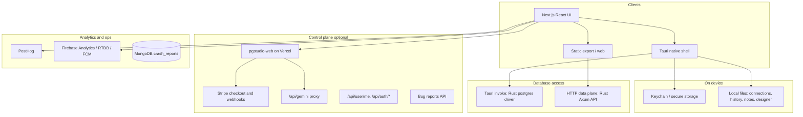

# pgStudio (HelixDB)

**pgStudio** is a performance-oriented **PostgreSQL client**: schema browsing, data grids, SQL editor, sessions, indexes, ER-style topology, AI-assisted query help, migrations tooling, and optional real-time collaboration. The product ships as a **Next.js** UI embedded in **Tauri** (macOS desktop, iOS path via Tauri), and can run in the **browser** when a **data plane** HTTP API is available.

Branding and version strings used in the UI and telemetry live in [`src/lib/app-config.ts`](src/lib/app-config.ts) (the npm package name remains `pgstudio`).

---

## End-to-end architecture



### How a query runs

1. **Desktop (Tauri):** The UI calls [`src/lib/db-platform.ts`](src/lib/db-platform.ts), which uses **`TauriDbPlatform`** and `invoke`s into Rust ([`src-tauri/src/commands.rs`](src-tauri/src/commands.rs) and [`src-tauri/src/db/`](src-tauri/src/db/)). The native process opens pools to your Postgres (optional **SSH tunnel** in `db_connect`).
2. **Web / iPad:** The same `db-platform` layer uses **`HttpDbPlatform`**: JSON over HTTPS to the **data plane** ([`data-plane/`](data-plane/)), with `Authorization: Bearer` (API key or JWT from the control plane). The browser does **not** store raw connection strings long-term in the MVP; it keeps an opaque `connection_id` after connect.
3. **Results** flow back as typed rows/columns into **Zustand** stores and components (data table, query editor, etc.).

See [`docs/DATA_PLANE_ARCHITECTURE.md`](docs/DATA_PLANE_ARCHITECTURE.md) for threat model, env vars, and the full **Tauri command → `/v1` route** mapping.

### Auth and subscriptions

- **Desktop:** OAuth-style login talks to the **control plane** (`NEXT_PUBLIC_WEB_APP_URL`, default [`https://pgstudio-web.vercel.app`](https://pgstudio-web.vercel.app)); tokens are stored in the **OS keychain** via Tauri ([`src/lib/auth-runtime.ts`](src/lib/auth-runtime.ts), [`src-tauri/src/auth.rs`](src-tauri/src/auth.rs)). **Stripe Checkout** is opened from the app; the Rust side calls `POST {WEB_APP_URL}/api/stripe/checkout`.
- **Web:** Session cookies on the control-plane origin are awkward cross-port; the app uses **hash/query JWT bridges** (`WebAccountHashBridge`, `WebAuthReturnSync`) and **`Authorization: Bearer`** to `GET /api/user/me`. A **`dataPlaneAccessToken`** in that response is saved for data-plane calls ([`src/lib/web-data-plane-token.ts`](src/lib/web-data-plane-token.ts)).

Trial gating and subscription UI: [`src-tauri/src/trial.rs`](src-tauri/src/trial.rs), [`src/components/trial-banner.tsx`](src/components/trial-banner.tsx), [`src/components/profile-panel.tsx`](src/components/profile-panel.tsx).

---

## Major features (by area)

| Area | What you get |
|------|----------------|
| **Connections** | Saved connections (Tauri: native storage; web: `localStorage` via [`saved-connections-api.ts`](src/lib/saved-connections-api.ts)), connection dialog, switcher, environments, optional local Postgres helpers on desktop |
| **Schema browser** | Schemas, tables, views, functions, types, triggers; row counts; context menus; create table/enum/database, table manager, seed data, export |
| **Data** | Paginated grid, sorting, multi-condition search, layout view, GeoJSON/map view ([`map-view/`](src/app/map-view/)) |
| **Query** | Monaco SQL editor, formatting, risk guard, history ([`query-history/`](src/app/query-history/)), read-only SQL paths, error parsing |
| **Sessions** | Live `pg_stat_activity`-style list; cancel/terminate backends |
| **Indexes** | Index builder UI |
| **Topology** | Schema- and database-level graph ([`schema-topology.tsx`](src/components/schema-topology.tsx), React Flow) |
| **AI** | Chat panel with **Gemini** (and related models) via **control plane** `POST /api/gemini` ([`ai-chat-engine.ts`](src/lib/ai-chat-engine.ts)); schema compression, streaming; suggestions worker on desktop |
| **Migrations** | Migration studio ([`migration-studio/`](src/app/migration-studio/)), diff helpers |
| **Schema projects** | Designer and projects pages ([`schema-projects/`](src/app/schema-projects/)); desktop file persistence in Rust |
| **Git / GitHub** | Git panel, deep link `pgstudio://git/callback` (desktop) |
| **Collaboration** | Firebase **Realtime Database** presence/signaling ([`collaboration-store.ts`](src/stores/collaboration-store.ts)); deep link `pgstudio://collab/join` |
| **Extensions** | List/install/update/uninstall Postgres extensions ([`extensions-management/`](src/app/extensions-management/)) — desktop-oriented paths |
| **Benchmarks** | [`benchmarks/page.tsx`](src/app/benchmarks/page.tsx) |
| **Bug reports** | [`bug-report/page.tsx`](src/app/bug-report/page.tsx) submits to **control plane** APIs ([`bug-reports.ts`](src/lib/bug-reports.ts)); not the same as automated crash ingest |
| **Settings** | Appearance, editor, data, query, AI, shortcuts, about |
| **Updates** | Desktop update check / modal ([`update-store.ts`](src/stores/update-store.ts), [`app-update-modal.tsx`](src/components/app-update-modal.tsx)) |
| **Command palette** | Global command UI ([`command-palette.tsx`](src/components/command-palette.tsx)) |

---

## Repository modules

| Path | Role |
|------|------|
| [`src/app/`](src/app/) | Next.js **App Router** pages (static export); main IDE shell is [`page.tsx`](src/app/page.tsx) |
| [`src/components/`](src/components/) | UI: sidebar, editors, dialogs, panels |
| [`src/stores/`](src/stores/) | **Zustand** state: connection, auth, layout, collaboration, trial, etc. |
| [`src/lib/`](src/lib/) | **db-platform** abstraction, AI, auth runtime, Firebase/PostHog helpers, types, utilities |
| [`src-tauri/`](src-tauri/) | **Tauri v2** app: window, menus, deep links, keychain auth, **Postgres** via Rust, local storage modules |
| [`data-plane/`](data-plane/) | **Rust Axum** service: `/health`, `/v1/connections`, queries, metadata, table ops (OpenAPI in [`data-plane/openapi.yaml`](data-plane/openapi.yaml)) |
| [`docs/DATA_PLANE_ARCHITECTURE.md`](docs/DATA_PLANE_ARCHITECTURE.md) | Design notes and web vs desktop matrix |
| [`docker-compose.yml`](docker-compose.yml) | **Redis** + **data-plane** for local HTTP mode |

---

## Third-party and backend services (what talks to what)

### Firebase ([`src/lib/firebase.ts`](src/lib/firebase.ts), [`firebase-provider.tsx`](src/components/firebase-provider.tsx))

- **Analytics:** Lazy-loaded **Firebase Analytics** in production; `session_start` and user properties (`app_version`, `app_name`, `channel`). Disabled in dev by default.
- **Crash-style signals:** `logException` from the error boundary and related paths (non-fatal analytics events, not a full crash symbolicator).
- **Realtime Database:** Used for **collaboration** when `databaseURL` is configured ([`collaboration-store.ts`](src/stores/collaboration-store.ts)).
- **Cloud Messaging:** Foreground push path in [`notifications.ts`](src/lib/notifications.ts) when the browser supports it; desktop uses **Tauri notifications** instead.

Env vars: `NEXT_PUBLIC_FIREBASE_*` (see [`getFirebaseConfig()`](src/lib/firebase.ts)).

### PostHog ([`src/lib/posthog-client.ts`](src/lib/posthog-client.ts))

- Initialized from **`PosthogAppProvider`**; **pageviews** are manual/opt-in (`capture_pageview: false`).
- **Exception capture** (`capture_exceptions`, `capturePosthogException`) from [`error-boundary.tsx`](src/components/error-boundary.tsx) and other call sites.
- **AI telemetry:** `ai_model_invocation` via `captureAiModelInvocation`.
- **Identity:** [`PosthogAuthBridge`](src/components/posthog-auth-bridge.tsx) `identify`s on login with email/name/provider.

Env: `NEXT_PUBLIC_POSTHOG_KEY`, optional `NEXT_PUBLIC_POSTHOG_HOST`; dev gated by `NEXT_PUBLIC_POSTHOG_ENABLE_DEV=true`.

### MongoDB ([`src/lib/mongo.ts`](src/lib/mongo.ts), [`src/app/api/crash-reports/`](src/app/api/crash-reports/))

- **Purpose:** Server-side **crash report** persistence (`crash_reports` collection) with dedupe **signature** hashing.
- **Important:** The app build uses **`output: "export"`** in [`next.config.ts`](next.config.ts), so **API routes are not part of the static bundle**. The crash-report routes are useful when you run **Next in Node** (e.g. `next dev`) or deploy a **serverful** Next app. For static/Tauri-only builds, automated crash POSTs to `/api/crash-reports` on the local origin may be unavailable unless you point clients at a hosted API.

Env: `MONGODB_URI`, optional `MONGODB_DB_NAME`.

### Control plane: pgstudio-web (separate deploy)

- **Default base:** [`src/lib/web-app-url.ts`](src/lib/web-app-url.ts) → `NEXT_PUBLIC_WEB_APP_URL` or `https://pgstudio-web.vercel.app`.
- **AI:** Browser calls `{base}/api/gemini` (API keys stay server-side).
- **Auth:** `/api/user/me`, `/api/auth/desktop-token`, `/api/auth/desktop-exchange`, login redirects with `return_to` / hash JWT.
- **Billing:** Stripe checkout + webhooks (local dev often uses `stripe listen --forward-to localhost:3001/api/stripe/webhook` against the **control-plane** port, not this repo’s static UI port).

### Stripe

- Not implemented as routes inside this static-export repo; **desktop** triggers checkout via the **control plane** ([`src-tauri/src/auth.rs`](src-tauri/src/auth.rs)). See README command below for webhook forwarding when developing billing.

---

## Local development

### Web UI only (Next.js)

```bash
pnpm install
pnpm dev
```

Open the dev server URL (default port **3000**). For browser data-plane access, set e.g.:

- `NEXT_PUBLIC_DATA_PLANE_URL=http://127.0.0.1:9847`
- Optional `NEXT_PUBLIC_DATA_PLANE_API_KEY`, JWT vars per [`docs/DATA_PLANE_ARCHITECTURE.md`](docs/DATA_PLANE_ARCHITECTURE.md)

### Tauri desktop (UI + native DB driver)

```bash
cd /path/to/helixDB
make dev
# or: pnpm tauri dev
```

### Data plane (Rust HTTP API)

```bash
make data-plane
# or: docker compose up --build
```

### iOS / LAN dev

The repo includes `pnpm ios:dev` scripts; see [`package.json`](package.json) and `TAURI_DEV_HOST` notes in [`next.config.ts`](next.config.ts).

---

## Building

### Static export (used by Tauri)

```bash
pnpm build
```

Output under `out/`. **`serverExternalPackages: ["mongodb"]`** only applies when running a Node Next server; the export itself is static assets.

### macOS `.app` and DMG

```bash
cd /path/to/helixDB && unset CI && cargo tauri build
```

Artifacts (paths may vary by version):

- **App:** `src-tauri/target/release/bundle/macos/pgStudio.app`
- **DMG:** `src-tauri/target/release/bundle/dmg/pgStudio_*_aarch64.dmg`

`package.json` also defines `build:mac` / `release:mac` for per-arch Tauri builds.

### Makefile shortcuts

```text
make dev          # Tauri + Next dev
make build        # Static export
make data-plane   # Run Rust API
make compose-up   # Docker: Redis + data-plane
make lint
```

---

## Sharing the Mac app and Gatekeeper

The DMG is often **not** Apple code-signed. Recipients may see *unidentified developer* or *app is damaged*.

1. **Right-click → Open** on `pgStudio.app` the first time, or use **Privacy & Security → Open Anyway**.
2. **Quarantine:** `xattr -cr /Applications/pgStudio.app`
3. **Production:** Apple Developer signing + notarization ([Tauri macOS signing](https://tauri.app/v1/guides/distribution/sign-macos/)).

---

## Stripe webhook (control plane dev)

When testing subscriptions against a local **pgstudio-web** instance:

```bash
stripe listen --forward-to localhost:3001/api/stripe/webhook
```

(Adjust host/port to match your control-plane server.)

---

## Apple / TestFlight

Project scripts under `apple/` (e.g. `./apple/check-and-staple.sh`, `./apple/build-and-upload-testflight.sh`). See `make push-mac` in the [Makefile](Makefile).

---

## Further reading

- [Data plane architecture](docs/DATA_PLANE_ARCHITECTURE.md) — auth modes, CORS, scaling notes, route map
- [OpenAPI](data-plane/openapi.yaml) — HTTP contract for browser mode