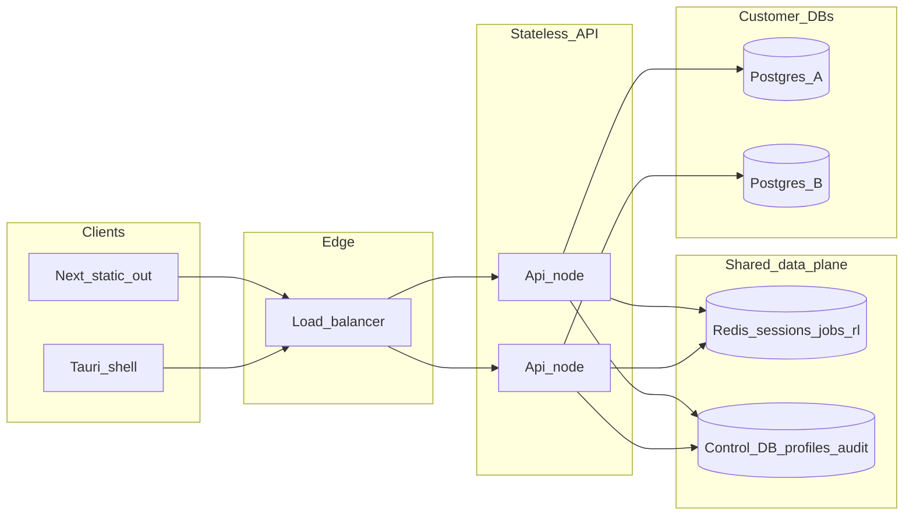

# Helix data plane architecture

This document describes the browser + desktop data plane: threat model, API mapping from Tauri `invoke` commands to versioned HTTP routes, core data models, scaling, and a web vs desktop capability matrix. The reference implementation lives in [`data-plane/`](../data-plane/) (Rust + OpenAPI).

## Goals

- One React UI for **static Next.js export** and **Tauri**: all database access goes through a **single frontend abstraction** ([`src/lib/db-platform.ts`](../src/lib/db-platform.ts)).
- **Phase 1** (implemented): connect, disconnect, refresh metadata cache, list schemas/tables, paginated table read, execute query — via `TauriDbPlatform` or `HttpDbPlatform`.
- Later phases extend the same interface and OpenAPI without breaking desktop defaults.

## Threat model

### Implemented in MVP API (`data-plane`)

- **Optional shared secret:** If `DATA_PLANE_API_KEY` is set, `/v1/*` accepts `Authorization: Bearer <key>` (constant-time compare). Intended for lab/staging and server-to-server calls.
- **JWT (HS256):** Set `DATA_PLANE_JWT_SECRET` (and optionally `DATA_PLANE_JWT_ISSUER`, `DATA_PLANE_JWT_AUDIENCE`) so the same `Authorization: Bearer` header can carry a short-lived user token minted by the control plane.
- **JWT (RS256 via JWKS):** Set `DATA_PLANE_JWKS_URL`; keys are fetched and cached for one hour (`auth_layer::JwksCache`).
- **`DATA_PLANE_REQUIRE_AUTH`:** When `true`, `/v1/*` returns 401 without credentials even if no API key or JWT verifier is configured (useful to avoid accidentally open proxies).
- **CORS:** Set `DATA_PLANE_CORS_ORIGINS` to a comma-separated list of allowed origins. If unset, any origin is allowed (logged at startup) — **not** for production.
- **Statement timeout:** `DATA_PLANE_STATEMENT_TIMEOUT_MS` (default `60000`) passed as a Postgres `options` startup parameter on new pools.
- **Pool limits:** `DATA_PLANE_POOL_MAX_SIZE` (default 8) per logical `connection_id`.
- **No browser storage of raw connection strings** when using HTTP mode: credentials are sent only to the API over TLS in production; the client keeps an opaque `connection_id`.

### Planned (document explicitly; not all implemented in code)

- **Encrypted connection profiles** at rest (KMS or AES-GCM per tenant) in a control-plane database.
- **Short-lived leases** for `connection_id`, Redis-backed session, rate limits, row/byte caps per query, audit log for DDL/destructive SQL.
- **Host allowlists** per profile to prevent using the API as an open DB proxy.
- **Circuit breakers** when pool checkout or upstream DB latency degrades.
- **SSH tunneling from the browser:** not supported without a dedicated agent or enterprise gateway; tunnel today is embedded in desktop `db_connect` only.

### Deferred / non-goals

- Arbitrary outbound TCP from the API to any host without policy (treat as high risk).
- Guarantee of SQL guard parity with every Tauri code path until `execute_query` / multi-statement logic is extracted into a **shared Rust crate** consumed by both `src-tauri` and `data-plane`.

## Data models

- **ConnectionProfile (web, future):** tenant id, display name, ciphertext connection string or secret ref, host allowlist, created_at.
- **Session (web, future):** authenticated user id, org id, expiry; maps to allowed `connection_id` leases.
- **Job (exports, future):** job id, type, status, progress events (SSE/WebSocket), artifact URL.
- **MVP:** in-memory `connection_id → pool` on each API node (scale-out requires sticky sessions or moving pool registry to Redis + reconnect — documented for later).

## API version

- Base path: **`/v1`**
- OpenAPI: [`data-plane/openapi.yaml`](../data-plane/openapi.yaml)

## Scaling (production target)

MVP `data-plane` is a single process; Redis in Compose is for future rate limiting / jobs and health checks.

### Control plane contracts (pgstudio-web)

- **Browser session:** `GET /api/user/me` with session cookies; optional JSON field `dataPlaneAccessToken` (short-lived JWT) is stored in `sessionStorage` by the Helix UI and sent as `Authorization: Bearer` to the data plane.
- **Web login return (localhost / iPad):** The Helix UI sends users to `/login?source=web&return_to=<url>&callbackUrl=<same>`. The **pgstudio-web** app validates `return_to`, mints a JWT (`POST /api/auth/desktop-token`), and redirects to `<return>#helix_account_jwt=<jwt>` so the Helix shell can authenticate **`/api/user/me` with `Authorization: Bearer`** (session cookies are not sent on cross-origin `fetch` from another port or host). See `WebAccountHashBridge` in the Helix app. Allowlisted origins: **`AUTH_TRUSTED_RETURN_ORIGINS`** in pgstudio-web. For a fixed return URL from Helix, set `NEXT_PUBLIC_AUTH_RETURN_URL`.
- **Desktop code exchange (preferred over JWT in query):** `POST /api/auth/desktop-exchange` with JSON `{ "code": "<one_time_code>" }` returning `{ "accessToken": "..." }` (and optional `error`). The desktop shell calls this after `pgstudio://auth/callback?code=…&state=…`. Legacy `?token=` callbacks remain supported.

## Web vs desktop capability matrix

| Capability | Desktop (Tauri) | Web (HTTP data plane) |
|------------|-----------------|------------------------|
| Postgres connect (direct) | Yes | Yes (MVP) |
| SSH tunnel in `db_connect` | Yes | No (use VPN / agent) |
| Local Postgres install | Yes | No |
| OS: open path, new window, logs | Yes | Degraded / browser alternatives |
| App Store update check | Yes | N/A |
| AI worker POST proxy | Yes | Use browser `fetch` or same-origin worker |
| Saved connections file | Yes (local) | Future: server profiles |
| Query history / notes / schema designer files | Yes (local) | Future: `/v1/me/...` |
| Git / GitHub integration | Yes | Future server-side or narrow scope |

## Appendix: Tauri `invoke` → `/v1` route mapping

Naming convention: **resource-oriented** REST under `/v1/connections/{connectionId}/...`. Mutations and uncommon reads map 1:1 from existing command names.

**Phase 1 (OpenAPI + `data-plane` implemented)**

| Tauri command | HTTP |
|---------------|------|
| `db_connect` | `POST /v1/connections` |
| `db_disconnect` | `DELETE /v1/connections/{connectionId}` |
| `db_refresh_cache` | `POST /v1/connections/{connectionId}/metadata/refresh` |
| `db_list_schemas` | `GET /v1/connections/{connectionId}/schemas` |
| `db_list_tables` | `GET /v1/connections/{connectionId}/schemas/{schema}/tables` |
| `db_get_table_data` | `GET /v1/connections/{connectionId}/schemas/{schema}/tables/{table}/rows` |
| `db_execute_query` | `POST /v1/connections/{connectionId}/query` |

**Postgres / metadata / data (to add in later OpenAPI revisions)**

| Tauri command | Proposed HTTP |
|---------------|----------------|
| `db_list_recent_tables` | `GET .../recent-tables` |
| `db_track_recent_table_open` | `POST .../recent-tables` |
| `db_get_schema_topology` | `GET .../schemas/{schema}/topology` |
| `db_get_columns` | `GET .../schemas/{schema}/tables/{table}/columns` |
| `db_get_documentation_context` | `GET .../documentation-context` |
| `db_apply_documentation_comments` | `POST .../documentation-comments` |
| `db_get_table_data_geojson` | `GET .../rows/geojson` |
| `db_lint_sql` | `POST /v1/lint/sql` |
| `db_insert_table_row` | `POST .../rows` |
| `db_insert_table_rows_bulk` | `POST .../rows:bulk` |
| `db_update_table_row` | `PATCH .../rows` |
| `db_delete_table_rows` | `DELETE .../rows` |
| `db_search_table_data` | `POST .../search` |
| `db_search_table_data_multi` | `POST .../search/multi` |
| `db_get_table_details` | `GET .../tables/{table}/details` |
| `db_rename_table` | `POST .../tables/{table}:rename` |
| `db_rename_column` | `POST .../tables/{table}/columns:rename` |
| `db_alter_column` | `PATCH .../tables/{table}/columns/{column}` |
| `db_add_column` | `POST .../tables/{table}/columns` |
| `db_drop_column` | `DELETE .../tables/{table}/columns/{column}` |
| `db_create_table` | `POST .../tables` |
| `db_truncate_table` | `POST .../tables/{table}:truncate` |
| `db_drop_table` | `DELETE .../tables/{table}` |
| `db_create_enum` | `POST .../types/enum` |
| `db_alter_enum_values` | `PATCH .../types/enum/{name}` |
| `db_list_databases` | `GET .../databases` |
| `db_get_access_profile` | `GET .../access-profile` |
| `db_list_extensions` | `GET .../extensions` |
| `db_get_extension_detail` | `GET .../extensions/{name}` |
| `db_install_extension` | `POST .../extensions/{name}:install` |
| `db_uninstall_extension` | `POST .../extensions/{name}:uninstall` |
| `db_update_extension` | `PATCH .../extensions/{name}` |
| `db_list_database_roles` | `GET .../roles` |
| `db_list_database_users` | `GET .../users` |
| `db_create_database_role` | `POST .../roles` |
| `db_get_database_role_detail` | `GET .../roles/{name}` |
| `db_grant_database_role_membership` | `POST .../roles/{name}/members` |
| `db_revoke_database_role_membership` | `DELETE .../roles/{name}/members/{member}` |
| `db_create_database_user` | `POST .../users` |
| `db_set_database_user_login` | `PATCH .../users/{name}/login` |
| `db_set_database_user_password` | `POST .../users/{name}:password` |
| `db_delete_database_user` | `DELETE .../users/{name}` |
| `db_list_password_reminders` | `GET .../password-reminders` |
| `db_delete_password_reminder` | `DELETE .../password-reminders/{id}` |
| `db_create_database` | `POST .../databases` |
| `db_drop_database` | `DELETE .../databases/{name}` |
| `db_list_event_triggers` | `GET .../event-triggers` |
| `db_list_functions` | `GET .../schemas/{schema}/functions` |
| `db_list_types` | `GET .../schemas/{schema}/types` |
| `db_get_pg_version` | `GET .../version` |
| `db_get_function_definition` | `GET .../schemas/{schema}/functions/{name}/definition` |
| `db_get_type_definition` | `GET .../schemas/{schema}/types/{name}/definition` |
| `db_import_schema` | `POST .../import-schema` |
| `db_export_sql` | `POST .../exports` + job polling/SSE |
| `db_watch_table` / `db_unwatch_table` / `db_is_watching` | `WS .../watch` or SSE |
| `db_get_sessions` | `GET .../sessions` |
| `db_terminate_backend` / `db_cancel_backend` | `POST .../sessions/{pid}:terminate` / `:cancel` |
| `db_explain_query` | `POST .../explain` |
| `db_sandbox_*` | `POST /v1/sandboxes` + sub-resources |
| `db_pg_stat_statements_*` | `GET/POST .../pg-stat-statements/...` |
| `db_get_indexes` | `GET .../schemas/{schema}/indexes` |
| `db_get_table_query_samples` | `GET .../schemas/{schema}/tables/{table}/query-samples` |
| `db_get_index_impact` | `GET .../index-impact` |
| `db_create_index` | `POST .../indexes` |
| `db_drop_index` | `DELETE .../schemas/{schema}/indexes/{name}` |
| `db_get_index_build_progress` | `GET .../schemas/{schema}/indexes/{name}/progress` |

**Saved connections (local file → web)**

| Tauri command | Proposed HTTP |
|---------------|----------------|
| `get_saved_connections` | `GET /v1/connection-profiles` |
| `save_connection` | `POST /v1/connection-profiles` |
| `delete_saved_connection` | `DELETE /v1/connection-profiles/{id}` |
| `update_saved_connection_database_name` | `PATCH /v1/connection-profiles/{id}` |

**Desktop / OS (no HTTP analog)**

- `local_postgres_*`, `open_path`, `open_new_window`, `app_log_write`, `app_log_path`, `get_media_permission_status`, `request_media_permissions`, `open_media_permission_settings`, `app_store_check_update`

**AI bridge**

| Tauri command | Web note |
|---------------|----------|
| `ai_suggestions_worker_post` | Same-origin fetch or BFF |

**Notes / schema designer / query history**

| Tauri command | Proposed HTTP prefix |
|---------------|----------------------|
| `notes_*` | `/v1/me/notes` |
| `schema_designer_*` | `/v1/me/schema-projects` |
| `query_history_*` | `/v1/me/query-history` |

**Auth / billing / trial**

| Tauri command | Proposed integration |
|---------------|----------------------|
| `auth_*`, `subscription_*`, `trial_*` | Align with [`pgstudio-web`](../../pgstudio-web): NextAuth session, BFF cookies; desktop may keep keychain or call same APIs |

**Git / GitHub**

| Tauri command | Proposed HTTP |
|---------------|----------------|
| `git_*`, `write_workspace_file`, `delete_workspace_file`, `sync_ide_files_to_workspace` | Server-side git workspace service (future) |
| `git_storage_*` | `/v1/me/git-workspaces` |
| `github_*` | `/v1/integrations/github/...` with OAuth in BFF |

## Backend language choice

**Rust** for the data plane (current `data-plane` crate): reuse patterns from `src-tauri` (`tokio-postgres`, `deadpool-postgres`, cell serialization aligned with [`db/types.rs`](../src-tauri/src/db/types.rs)). Alternatives (Go/Node) are viable if OpenAPI parity tests are maintained; this repo standardizes on Rust for minimal drift.

## Frontend migration

- Use [`createDbPlatform()`](../src/lib/db-platform.ts): **Tauri** when `isTauri()` is true; otherwise **HTTP** when `NEXT_PUBLIC_DATA_PLANE_URL` is set.
- Phase-1 call sites import `dbConnect`, `dbDisconnect`, `dbListSchemas`, `dbListTables`, `dbGetTableData`, `dbExecuteQuery`, `dbRefreshCache` from `@/lib/db-platform`.
- All other functions remain on `@/lib/tauri` until the interface grows.

## Local development

See **[`docker-compose.yml`](../docker-compose.yml)** in this app directory (API + Redis + optional Postgres for future control plane).
